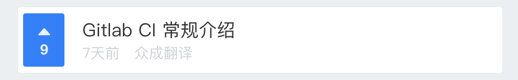

title: BEM命名法及常用CSS class 命名
author:
  name: 轻剑快马
  url: https://github.com/xrr2016
controls: false
output: presentations/BEM命名法及常用class命名.html

--
# BEM命名法及常用CSS class 命名

--

### 什么是BEM

Block(块), Element(元素), Modifier(修饰符)，是一种命名CSS class的模式，使用这种模式可以让 CSS 代码更加利于维护。

`.block-name__element-name--modifier-name`

- 名字用小写字母书写。
- Block, Element, Modifier中的单词用连字符 - 分隔。
- Element与块名称用双下划线 __ 分隔。
- Modifier通过双连字符 -- 与块或元素的名称分开。

--
### 为什么要使用BEM

团队项目的CSS代码有多人共同开发，每个人的代码风格，习惯大不相同，由于没有统一的规范，在阅读别人或者自己之前写的CSS的时候，要花大量的时间去弄清楚代码的含义，使用BEM就是为了提高团队开发和维护效率。

--

### Block

页面上逻辑和功能独立的，可复用的组件，可以嵌套，但在语义上它们保持平等，可以存在页面上不同的位置或不同项目中，保持样式不变。

任何html元素都可以成为一个Block，不依赖于页面上的其他Block或者Element。

```html
<header class="header"></header>
```

```css
.header {
  padding: 0 20px;
  color: #333;
  background: #f5f5f5;
}
```

--

### Element

组成Block的一部分，Block内部的任何元素都与块有关联，不能在块的外部使用。

```html
<article class="article">
  <h2 class="article__title"></h2>  <!-- element -->
  <p class="article__content"></p>  <!-- element -->
</article>
```

```css
.article {
  padding: 12px;
}

.article__title {
  font-size: 1rem;
}

.article__content {
   font-size: .9rem;
}
```

--

### Modifier

用来表示块或元素的状态，外观，行为等，可选。

```html
<button class="btn btn--disabled"></button>
```

```css
.btn {
  color:  #333;
  background-color: #fff;
}

.btn--disabled {
  color: #fff;
  background-color: #6c757d;
}
```

--

### BEM使用示例



```html
<li class="list-item">
  <div class="list-item__rank">
    <i class="list-item__rank-icon"></i>
    <p class="list-item__rank-num">9</p>
  </div>
  <div class="list-item__content">
    <p class="list-item__title">Gitlab CI 常规介绍</p>
    <p class="list-item__info">
      <small class="list-item__date">7天前</small>
      <small class="list-item__author">众成翻译</small>
    </p>
  </div>
</li>
```

[BEM DEMO](https://codepen.io/xrr2016/pen/PepgKE)

--

### 常用CSS class 命名

<small style="font-size: 20px;">
**包裹类：** container, wrapper, outer, inner, box, header, footer, main, content, aside, page, section, block
</small>

<small style="font-size: 20px;">
**状态类：** primary, secondary, success, danger, warning, info, error, link, light, dark, disabled, active, checked, loading
</small>

<small style="font-size: 20px;">
**尺寸类：** large, middle, small, bigger, smaller
</small>

<small style="font-size: 20px;">
**组件类：** card, list, picture, carousel, swiper, menu, navs, badge, hint, modal, dialog
</small>

<small style="font-size: 20px;">
**文本类：** title, desc, content, date, author, category，label，tag
</small>

<small style="font-size: 20px;">
**人物类：** avatar, name, age, post, intro
</small>

--

### 结语

BEM 不是必须的，你依然可以选择自己喜欢的方式编写你的 CSS 代码。

使用 BEM 主要目的是为了在团队开发中有一个统一的规范，利于代码的维护，在别人接手你的代码，或者接手别的代码时能够更加快速的理解代码。

--

### 参考资源

[Get BEM](http://getbem.com/)

[BEM](https://en.bem.info/)

[BEM思想之彻底弄清BEM语法](https://www.w3cplus.com/css/mindbemding-getting-your-head-round-bem-syntax.html)

[什么鬼，又不知道怎么命名class了](http://imweb.io/topic/5623c25734764b2c16769749)

--