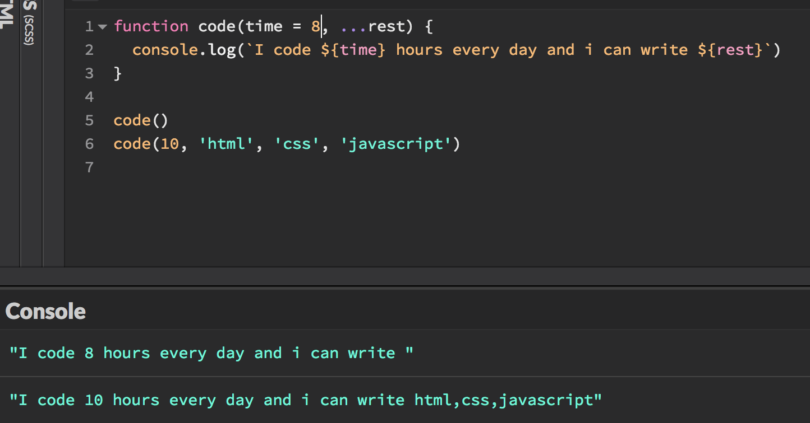

title: ES6常用语法简介
author:
  name: 轻剑快马
  url: https://github.com/xrr2016
controls: false
output: presentations/ES6常用语法简介.html

--

# ES6 常用语法简介

--

### 使用 let 和 const 代替 var

let 用来声明变量，值可以改变。const 用来声明一个只读的常量，值不能改变。使用 let声明的变量 和 const 命令声明的常量都拥有块级作用域，在同一作用域内不容许重复声明，不存在‘变量提升’现象。

```js
let name = 'Jack'
name = 'John'

const COMPANY_NAME = 'VMEI'
```

--

### 箭头函数

箭头函数 `=>` 是一种声明函数的简写形式，它可以绑定代码书写时的当前作用域，从而避免再声明类似 that, self, _this 等变量保存当前作用域。

```js

function add10(x) { return x += 10 }

const add10 = x => x += 10

```

--

### 对象和数组的解构赋值

按照一定的模式从数组或对象中提取值，然后对变量赋值。

```js
const user = {
  name: 'rose',
  age: 24
}
const colors = ['red', 'blue', 'green', 'yellow', 'purple']

const userName = user.name
const userAge = user.age
const firstColor = colors[0]
const secondColor = colors[1]

const { name, age, gender } = user
const [firstColor, secondColor] = colors

let a = 1234
let b = 4321
;[a, b] = [b, a]

// a --> 4321
// b --> 1234
```

--

### 模板字符串

模版字符串是增强的字符串，使用反引号 ` 标识，可以定义多行字符串，以及在字符串中使用变量。

```js
const book = {
  name: '这样写出好故事',
  price: 56
}

console.log(`《${book.name}》 需要 ${book.price}元才能买到。`)

// 《这样写出好故事》 需要 56元才能买到。

```

--

### Promise 对象

--

### Async 函数

async 函数主要用来处理异步操作，如异步请求，文件读写，定时器等， 它的返回值是一个 Promise 对象。

```js
function sleep(ms) {
  return new Promise(resolve => {
    setTimeout(resolve, ms)
  })
}

async function log() {
  await sleep(3000)
  console.log('3秒后。')
}

log()

```

--

### Class 关键字

class 关键字用来定义‘类’，实际上是基于 prototype 的语法糖。

```js
function Dog(name, age) {
  this.name = name
  this.age = age
}
Dog.prototype.speak = function () { console.log('汪!') }

class Cat {
  constructor(name, age) {
    this.name = name
    this.age = age
  }
  speak() {
    console.log('喵.')
  }
}

const xiaohei = new Dog('小黑', 1)
const xiaobai = new Cat('小白', 1)
xiaohei.speak() // 汪!
xiaobai.speak() // 喵.
```

--

### 模块系统

Javascript 的模块使用静态加载模式，在代码编译时完成对模块的加载，相当于对文件的一个引用，等到脚步需要执行时，再去那个模块内取值。
关键字 `import`，`export`。

```js
// a.js
export const ten = 10
export const addOne = x => x += 1

// b.js
import { ten, addOne } from './a'

console.log(ten, addOne(ten))

// 10, 11

```

--

### 对象的扩展

更简洁的语法，属性名变量， 对象的扩展运算符（...）。

```js
const name = 'leo'
const gender = 'male'
const key = 'job'

const person = {
  name,
  gender,
  [key]: 'Teacher',
  work() {
    console.log('Teaching and educating people。')
  }
}
const ontherPreson = {...person }

person.work()
ontherPreson.work()

```

--

### 函数的扩展

默认参数，rest 参数。



--

### 数组的扩展

--

### 参考资料

[ECMAScript 6 入门](http://es6.ruanyifeng.com/)

[ECMAScript 6 — New Features](http://es6-features.org/#Constants)

[Modern JavaScript Cheatsheet](https://github.com/mbeaudru/modern-js-cheatsheet)

--
