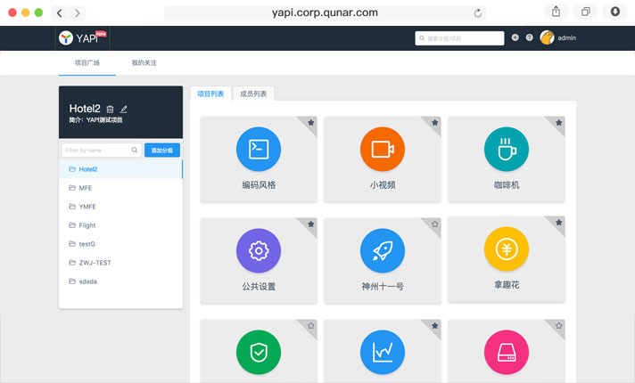
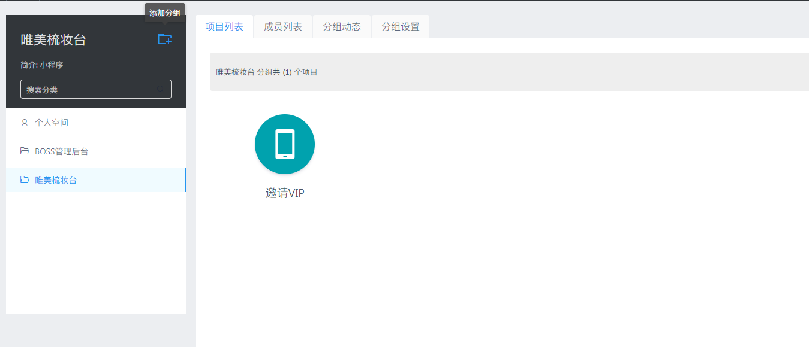
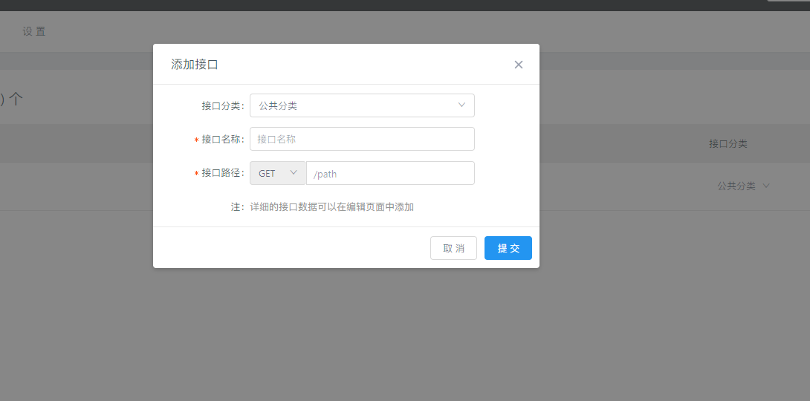
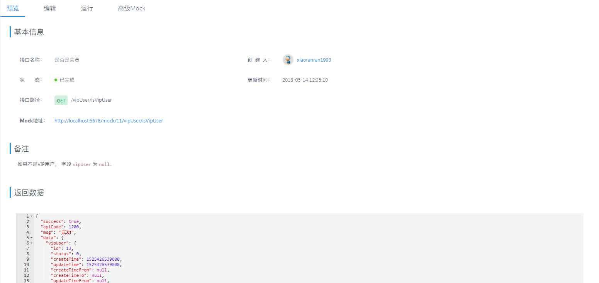
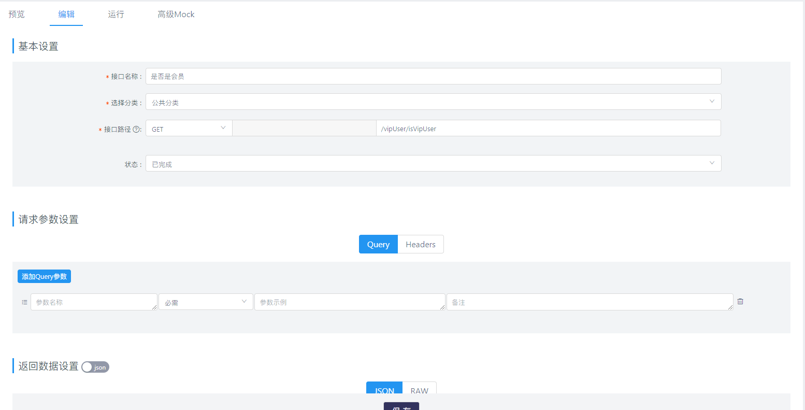
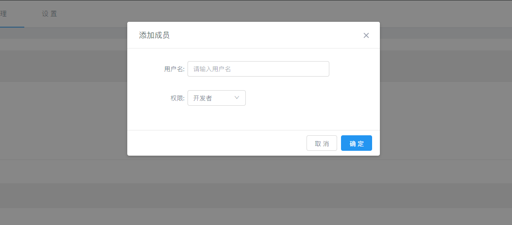

title: YApi使用指南
author:
  name: 轻剑快马
  url: https://github.com/xrr2016
controls: false
output: presentations/YApi使用指南.html

--

# YApi使用指南

--

### 什么是 YApi

<small style="font-size: 18px;">
  旨在为开发、产品、测试人员提供更优雅的接口管理服务。可以帮助开发者轻松创建、发布、维护 API
</small>

一个管理接口的工具

--

### 如何使用 YApi

1. 注册账号
2. 添加或选择分组
3. 在分组内添加项目
3. 在项目内添加接口
4. 在项目内添加成员

--

### 注册账号

注册地址 http://192.168.0.197:5678/login

--

### 添加或选择分组

--

### 添加项目

在一个分组下添加新的项目, 输入名称，所属分组，选择权限

--

### 添加接口

在一个分类下添加新的接, 输入接口名称，路径

--

### 接口预览

--

### 编辑接口
- 基本设置
- 请求参数设置
- 返回数据设置
- 备注

--

### 邀请成员

--

### 文档

[YApi](https://yapi.ymfe.org/)

--
